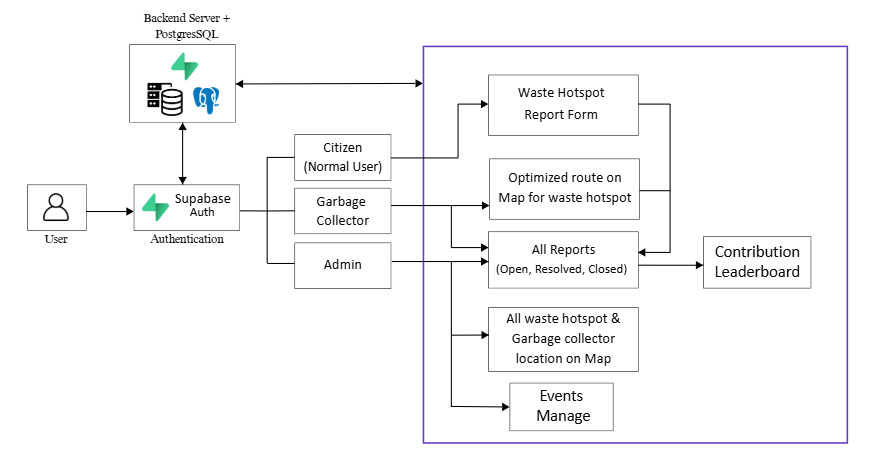

# ♻️ Community Waste Management System

A web-based platform designed to empower citizens, streamline garbage collection, and support government-led cleanliness initiatives through technology and community participation.

## 🌍 Problem Statement

Improper waste disposal and unreported garbage hotspots lead to health risks, environmental damage, and inefficient waste collection.
Traditional reporting systems lack real-time tracking, citizen motivation, and optimized collection workflows.

---

## ✅ Solution Overview

The Community Waste Management System connects citizens, garbage collectors, and administrators on a single platform to:
- Report garbage hotspots with proof
- Track and resolve waste issues efficiently
- Motivate citizens through government-backed events and rewards
- Optimize garbage collection routes using location intelligence

--- 

## ⚡User Roles & Features

### 1️⃣ Normal User (Citizen)
   - Report garbage hotspots with image & description
   - Automatic location detection (GPS)
   - Track report status: Open / Resolved / Rejected
   - Earn contribution points for valid reports
   - Appear on leaderboard
   - Participate in government-backed cleanliness events and win rewards

### 2️⃣ Garbage Collector
   - View nearby waste reports on dashboard
   - Get optimized routes with estimated travel time
   - Filter reports by distance
   - Mark reports as resolved after waste collection

### 3️⃣ Admin
   - View and manage all reports
   - Monitor live locations of garbage collectors
   - Create and manage events & reward criteria
   - Control users, collectors, and platform activities
     
---

## 🏆 Leaderboard & Rewards System

   - Users earn points for valid garbage reports
   - Rankings updated in real time
   - Top contributors during events:
     - Receive government awards
     - Public recognition
     - Certificates / prizes (as defined by event)

--- 

## 🛠️ Tech Stack
### Frontend
- **Framework**: Next.js 14 (App Router)
- **Language**: TypeScript
- **Styling**: Tailwind CSS
- **UI Components**: Radix UI + shadcn/ui
- **Maps**: Leaflet + React Leaflet
- **Icons**: Lucide React
- **Image Handling**: Next.js Image Optimization

### Backend & Database
- **Database**: Supabase (PostgreSQL)
- **Authentication**: Supabase Auth
- **Storage**: Supabase Storage (image uploads)
- **Real-Time**: Supabase Realtime subscriptions
- **Security**: Row Level Security (RLS) policies

### APIs & Services
- **Routing**: OpenRouteService API
- **Geolocation**: Browser Geolocation API
- **Reverse Geocoding**: OpenStreetMap Nominatim
  
---

## 🏗️ System Architecture



---

## ✨ Future Enhancements
   - AI-based garbage detection in images
   - Carbon footprint & cleanliness metrics
     
---

## 🚀 Getting Started

### Prerequisites
- Node.js 18+ and npm/pnpm
- Supabase account
- OpenRouteService API key

### Installation

1. **Clone the repository**
```bash
git clone <repository-url>
cd community-waste-management
```

2. **Install dependencies**
```bash
pnpm install
```

3. **Set up environment variables**

Create a `.env.local` file in the root directory:

```env
NEXT_PUBLIC_SUPABASE_URL=your_supabase_project_url
NEXT_PUBLIC_SUPABASE_ANON_KEY=your_supabase_anon_key
NEXT_PUBLIC_ORS_KEY=your_openrouteservice_api_key
```

4. **Initialize the database**

Run the SQL script in your Supabase SQL editor:

```bash
# File: scripts/init_database.sql
```

This creates:
- `profiles` table (user metadata)
- `waste_reports` table (report data)
- Row Level Security policies
- Storage buckets for images

5. **Run the development server**

```bash
pnpm dev
```

Open [http://localhost:3000](http://localhost:3000) in your browser.

## 📁 Project Structure

```
community-waste-management/
├── app/
│   ├── admin/              # Admin dashboard
│   ├── auth/               # Authentication pages
│   │   ├── login/
│   │   ├── sign-up/
│   │   └── error/
│   ├── collector/          # Garbage collector interface
│   │   ├── page.tsx
│   │   ├── ReportsList.tsx
│   │   └── NavigationView.tsx
│   ├── report/             # New report form
│   ├── reports/            # Main reports page
│   └── types/              # TypeScript types
├── components/
│   ├── ui/                 # Reusable UI components
│   ├── admin-reports-list.tsx
│   ├── report-form.tsx
│   ├── reports-list.tsx
│   └── rank-list.tsx
├── lib/
│   ├── supabase/           # Supabase client configs
│   └── utils/              # Utility functions
├── public/                 # Static assets
└── scripts/
    └── init_database.sql   # Database schema
```
---

#### ~ *A collaborative platform bridging citizens, collectors, and government for a cleaner future.* 🌍♻️🤝
